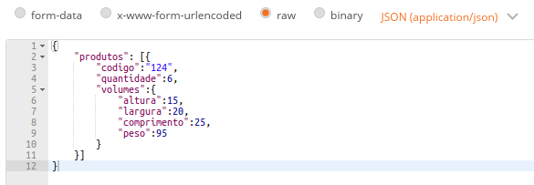
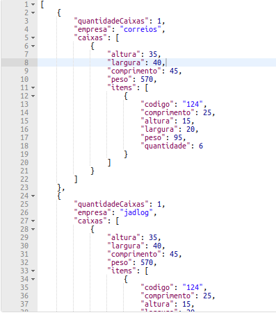
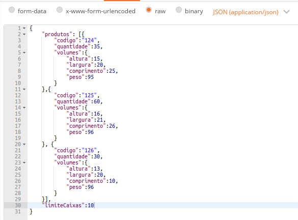
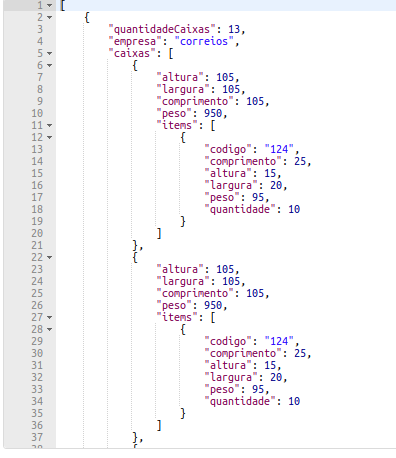
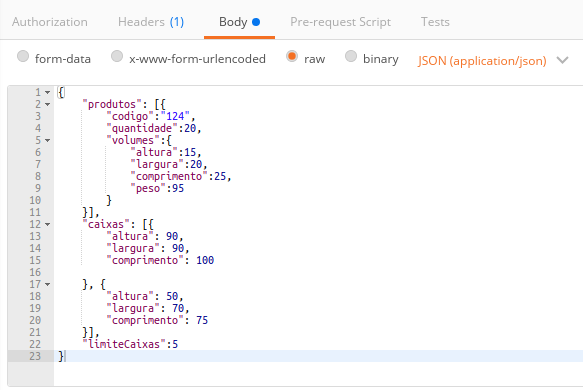
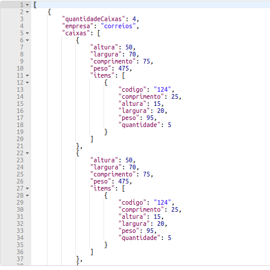
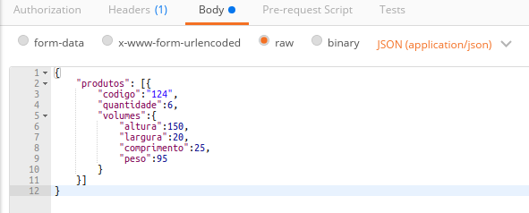
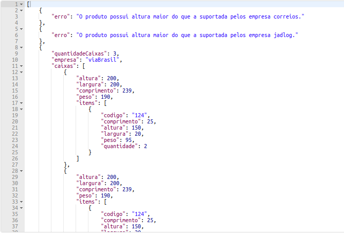

# Teste Melhor Envio
Os arquivos estão divididos no padrão MVC.

## Informações sobre o desenvolvimento
### Tecnologias
**NodeJS**

**MongoDB**

### Ferramentas
**VSCode:** Utilizado para programar

**Studio 3T:** Utilizado para consultar os dados no banco de dados

**Postman:** Utilizado para testar as rotas, requisições e respostas

**mLab:** Ferramenta online para armazenar dados em MongoDB

## Como testar
Para testar é necessário fazer o clone dos arquivos para uma pasta no computador e instalar os módulos do node:
```
git clone https://github.com/Gleider/teste-melhor-envio.git
```
```
npm install 
```
Para inicialiar o projeto, é só digitar:
```
npm start
```
O servidor irá rodar no localhost:3000.
Enquanto o servidor está rodando, pode rodar alguns testes:
```
npm test
```
Os dados estão armazenados no servidor do mLab, então não precisa baixar os dados para a máquina local.

### Testar no postman
Duas rotas podem ser testadas:
http://localhost:3000/comprar : Enviar os produtos e receber a quantidade de caixas e os produtos
http://localhost:3000/produtos : Registrar um novo produto no banco de dados

Já que o objetivo é o envio de produtos e o retorno da quantidade de caixas, então a única rota que será mostrada as operações é a de comprar e sempre será utilizado o método POST.

#### Exemplo 1: 
Enviando 1 produto:



Resposta:



*A resposta é maior do que mostrada na imagem

#### Exemplo 2:
Enviando 3 produtos e com limite de 10 itens por caixa:



Resposta:



*A resposta é maior do que mostrada na imagem

#### Exemplo 3:
Enviando 1 produto com limite de 5 itens por caixa e enviando 2 configurações de caixa:



Resposta:



*A resposta é maior do que mostrada na imagem

#### Exemplo 4:
Enviando 1 produto ultrapassando o limite dos correios e da jadlog



Resposta:



*A resposta é maior do que mostrada na imagem

### O que faltou no teste
- Refatorar os algoritmos de empacotamento para que fossem mais eficientes.
- Criar mais casos de testes
- Tratar de maneira mais clara os erros.
- Criar uma documentação com mais detalhes e mais organizada.
